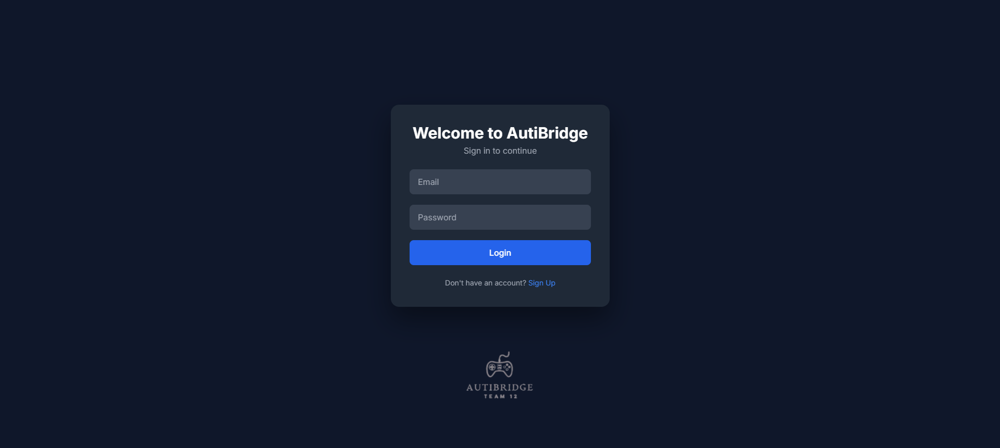
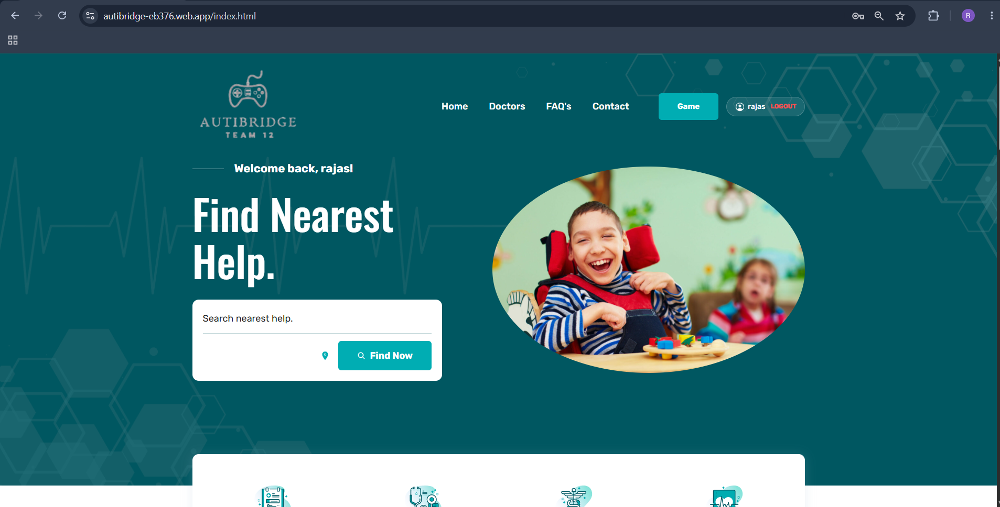
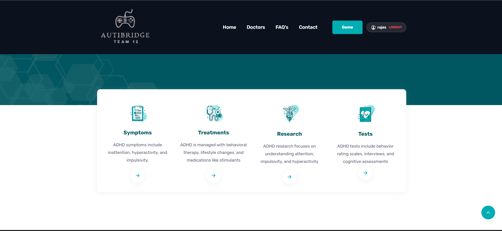
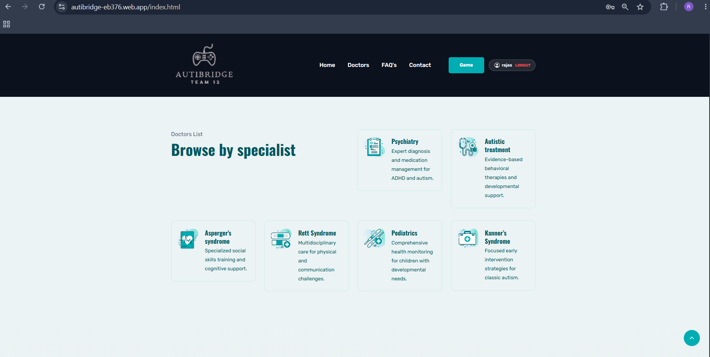
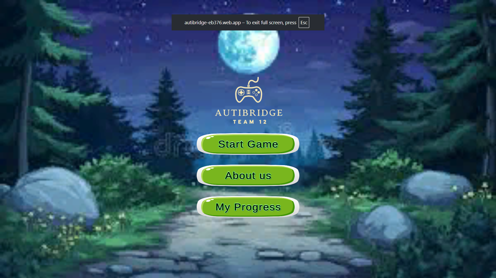
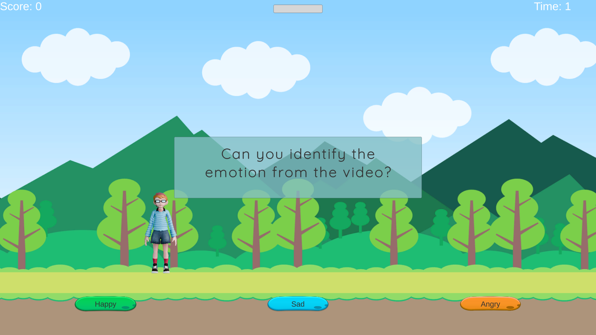
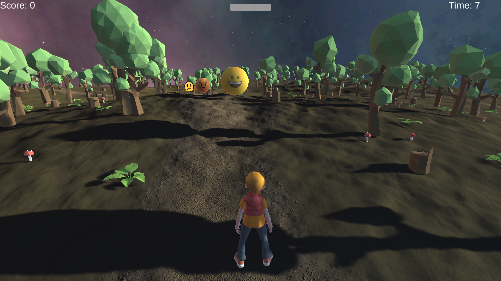
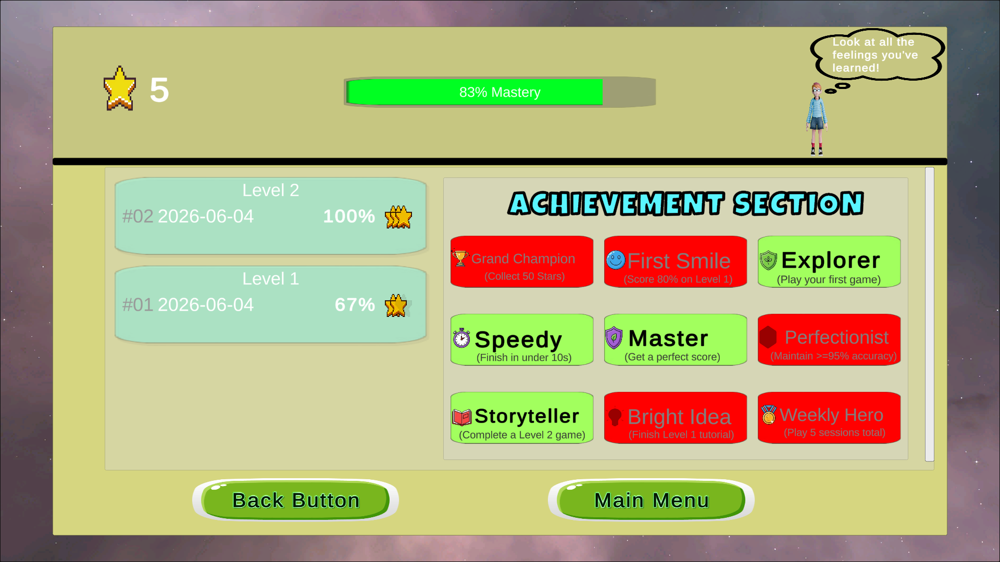
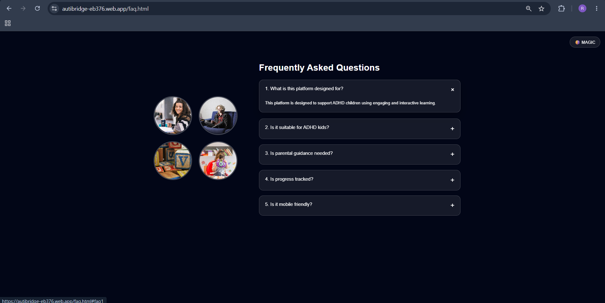
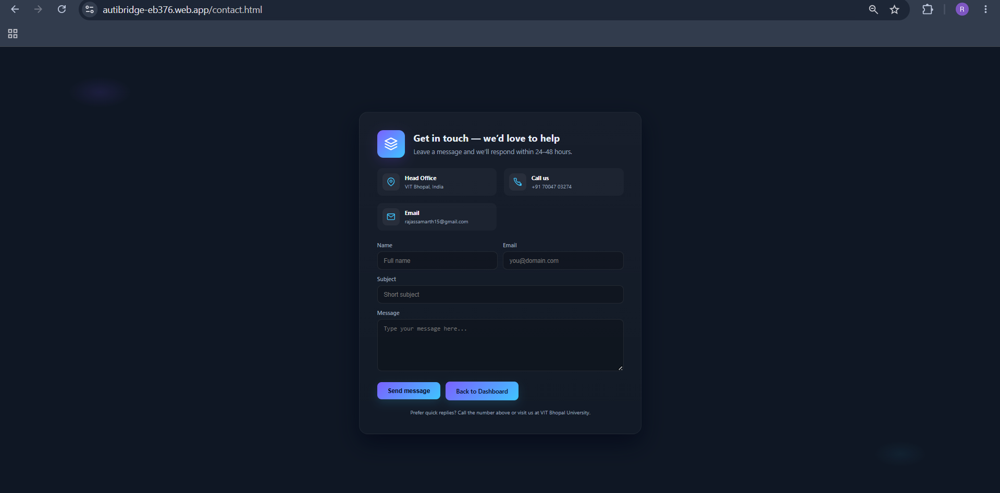

# 🌉 AutiBridge — Autism Support Web Platform

> **Bridging families with the resources and tools they need to support autistic children.**

[](https://autibridge-eb376.web.app)
[](https://autibridge-backend.onrender.com)
[](https://github.com/RajasSamarth/autibridge)

---

## 📌 Live Demo

🔗 **Website:** [https://autibridge-eb376.web.app](https://autibridge-eb376.web.app)  
🔗 **Backend API:** [https://autibridge-backend.onrender.com](https://autibridge-backend.onrender.com)

> ⚠️ The backend is hosted on Render's free tier and may take **30–60 seconds** to wake up on the first request.

---

## 📖 About The Project

**AutiBridge** is a comprehensive full-stack web platform designed as a support ecosystem for the autism community. It acts as a "bridge" connecting families of autistic children with essential local healthcare resources, verified specialists, and engaging developmental tools — all in one safe, calming digital environment.

### The Problem We Solve

Families of autistic children often feel isolated and overwhelmed. They struggle to find:
- Verified local autism specialists and hospitals
- Sensory-friendly, effective tools for their child's development
- Reliable, consolidated resources instead of scattered internet searches

AutiBridge addresses all of these in a single integrated platform.

---

## 🖥️ Screenshots

### Login & Registration


### Home Dashboard


### Medical Resources


### Specialist Directory


### Unity Game — Main Menu


### Unity Game — Level 1 (Emotion Videos)


### Unity Game — Level 2 (3D Emotion World)


### Achievement & Progress Tracking


### FAQ Page


### Contact Page


---

## ✨ Features

### 🏥 Healthcare Resources
- Find nearest autism hospitals and specialists via Google Maps integration
- Browse specialists by category: Psychiatry, Autistic Treatment, Asperger's Syndrome, Rett Syndrome, Pediatrics, Kanner's Syndrome
- Latest autism news and research articles

### 🎮 Interactive Unity Games (WebGL)
- **Level 1 — Emotion Videos:** Children watch short video clips and identify the emotion shown (Happy, Sad, Angry) with guided character "Pip"
- **Level 2 — 3D Emotion World:** An immersive 3D environment where children navigate and identify floating emotion faces
- **Level 3 — Stories:** (Unlockable) Story-based emotion scenarios
- Progress tracking with mastery percentage, star ratings and session history
- Achievement badges: Grand Champion, First Smile, Explorer, Speedy, Master, Perfectionist, Storyteller, Bright Idea, Weekly Hero

### 🔐 Authentication
- Secure user registration and login
- JWT-based stateless authentication
- BCrypt password hashing
- Protected routes — all pages require authentication

### 📋 Parent Portal
- Child profile management (name, age, diagnosis level, notes)
- Milestone tracking to record developmental achievements
- Game score history per child
- FAQ section for common parenting questions

### 📬 Contact
- Contact form for reaching the AutiBridge team
- Location: VIT Bhopal University, Kothri Kalan

---

## 🛠️ Tech Stack

### Frontend
| Technology | Purpose |
|---|---|
| HTML5, CSS3, JavaScript | Core frontend |
| Tailwind CSS | Login/signup page styling |
| Unity (WebGL Build) | Interactive emotion games |
| Firebase Hosting | Frontend deployment |

### Backend
| Technology | Purpose |
|---|---|
| Java 21 | Programming language |
| Spring Boot 3.3 | REST API framework |
| Spring Security | Authentication & authorization |
| JWT (jjwt 0.12.3) | Stateless token-based auth |
| Spring Data JPA | Database ORM |
| Hibernate | Entity management |
| MySQL | Relational database |
| HikariCP | Database connection pooling |
| Maven | Build tool |
| Docker | Containerization for deployment |

### Infrastructure
| Service | Purpose |
|---|---|
| Render | Backend hosting (Docker container) |
| Aiven | Cloud MySQL database (Bangalore region) |
| Firebase Hosting | Frontend hosting |
| GitHub | Version control (monorepo) |

---

## 🗄️ Database Schema

```sql
users          — Parent accounts (id, name, email, password, role)
children       — Child profiles linked to parents
games          — Game catalog (name, category, difficulty)
game_scores    — Child performance per game session
articles       — Parenting resources and medical articles
milestones     — Child developmental achievements
```

---

## 🔌 API Endpoints

| Method | Endpoint | Description | Auth |
|--------|----------|-------------|------|
| POST | `/api/auth/register` | Register new parent account | Public |
| POST | `/api/auth/login` | Login and receive JWT token | Public |
| GET | `/api/users/me` | Get current user profile | Required |
| GET | `/api/children` | Get all children for logged-in parent | Required |
| POST | `/api/children` | Add a new child profile | Required |
| PUT | `/api/children/{id}` | Update child profile | Required |
| DELETE | `/api/children/{id}` | Delete child profile | Required |
| GET | `/api/games` | Get all available games | Required |
| POST | `/api/games/scores` | Submit game score for a child | Required |
| GET | `/api/games/scores/child/{id}` | Get all scores for a child | Required |
| GET | `/api/articles` | Get all articles | Required |
| GET | `/api/articles/category/{cat}` | Get articles by category | Required |
| POST | `/api/articles` | Create new article | Required |
| POST | `/api/progress/milestones` | Add a milestone | Required |
| GET | `/api/progress/milestones/child/{id}` | Get milestones for a child | Required |

---

## 🚀 Running Locally

### Prerequisites
- Java 21
- Maven
- MySQL
- Node.js (for Firebase CLI)

### Backend Setup

```bash
# Clone the repository
git clone https://github.com/RajasSamarth/autibridge.git
cd autibridge/backend/autibridge

# Create MySQL database
mysql -u root -p
CREATE DATABASE autibridge;

# Update src/main/resources/application.properties
spring.datasource.url=jdbc:mysql://localhost:3306/autibridge
spring.datasource.username=root
spring.datasource.password=yourpassword
jwt.secret=your-secret-key-minimum-32-characters

# Run the application
mvn spring-boot:run
```

The API will start at `http://localhost:8080`

### Frontend Setup

```bash
cd autibridge/frontend/.../trydoclab/doclab

# Update assets/js/api.js
const API_BASE = 'http://localhost:8080/api';

# Open with VS Code Live Server or any static server
```

---

## 👥 Team

This project was developed as a Capstone Project at **VIT Bhopal University** by **Team 12**, under the supervision of **Dr. Ajay Sharma**.

| Name | Roll No | Role |
|------|---------|------|
| Rajas Samarth | 22BCG10015 | Backend Development (Spring Boot, MySQL, JWT, Deployment) |
| Dhruv Choksi | 22BCG10018 | Unity Game Development |
| Abhinav Singh | 22BCG10059 |  Frontend Development |


---

## 📁 Project Structure

```
autibridge/
├── backend/
│   └── autibridge/
│       ├── src/main/java/com/autibridge/
│       │   ├── auth/          # JWT auth, login, register
│       │   ├── config/        # Security config, CORS, data seeder
│       │   ├── user/          # User entity, repository
│       │   ├── child/         # Child profiles CRUD
│       │   ├── games/         # Games and scores
│       │   ├── articles/      # Resources and articles
│       │   ├── progress/      # Milestones tracking
│       │   └── exception/     # Global error handling
│       ├── src/main/resources/
│       │   ├── application.properties
│       │   └── application-prod.properties
│       └── Dockerfile
└── frontend/
    └── .../doclab/
        ├── index.html         # Main dashboard
        ├── login.html         # Auth page
        ├── Games.html         # Games directory
        ├── faq.html           # FAQ page
        ├── contact.html       # Contact page
        ├── Unity Game/        # WebGL game build
        └── assets/
            ├── css/style.css
            └── js/
                ├── api.js     # Spring Boot API helper
                └── script.js  # UI interactions
```

---

## 🔒 Security Features

- Stateless JWT authentication (no server-side sessions)
- BCrypt password hashing (strength factor 10)
- Spring Security filter chain with role-based access
- CORS configured for specific allowed origins
- All endpoints except `/api/auth/**` require valid JWT

---

## 📄 License

This project is licensed under the MIT License — see the [LICENSE](LICENSE) file for details.

---

<p align="center">Made with ❤️ by Team 12 — VIT Bhopal University</p>
<p align="center">
  <a href="https://autibridge-eb376.web.app">Live Demo</a> •
  <a href="https://github.com/RajasSamarth/autibridge">GitHub</a>
</p>
